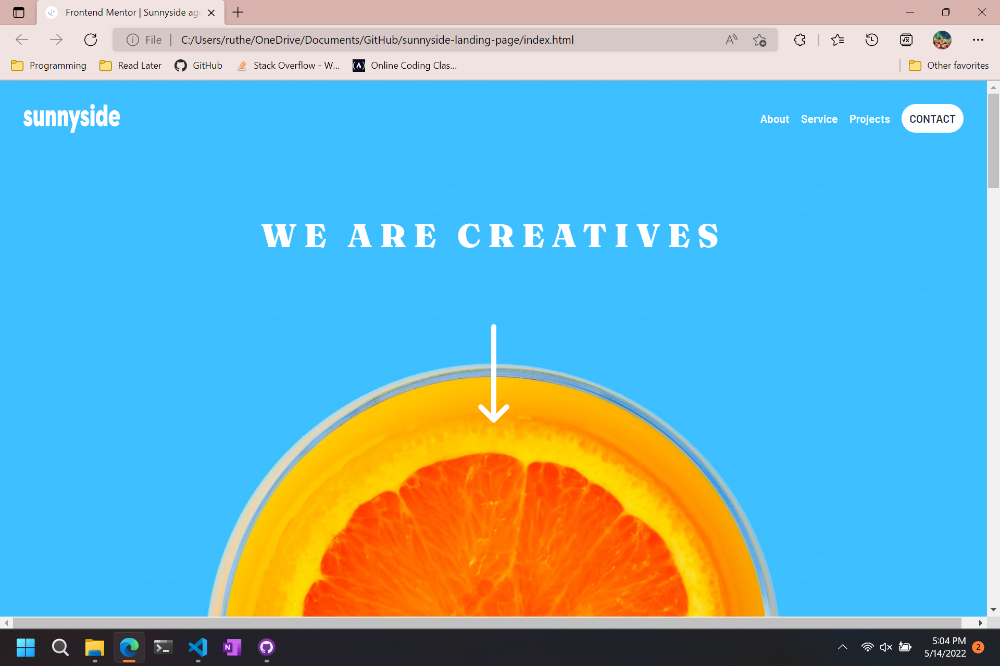

# Frontend Mentor - Sunnyside agency landing page solution

This is a solution to the [Sunnyside agency landing page challenge on Frontend Mentor](https://www.frontendmentor.io/challenges/sunnyside-agency-landing-page-7yVs3B6ef). Frontend Mentor challenges help you improve your coding skills by building realistic projects.

## Table of contents

- [Overview](#overview)
  - [The challenge](#the-challenge)
  - [Screenshot](#screenshot)
  - [Links](#links)
- [My process](#my-process)
  - [Built with](#built-with)
  - [What I learned](#what-i-learned)
  - [Continued development](#continued-development)
- [Author](#author)

**Note: Delete this note and update the table of contents based on what sections you keep.**

## Overview

### The challenge

Users should be able to:

- View the optimal layout for the site depending on their device's screen size
- See hover states for all interactive elements on the page

### Screenshot

### Links

- Solution URL: [https://hazipan.github.io/sunnyside-landing-page/](https://hazipan.github.io/sunnyside-landing-page/)
- Live Site URL: [https://hazipan.github.io/sunnyside-landing-page/](https://hazipan.github.io/sunnyside-landing-page/)

## My process

### Built with

- Semantic HTML5 markup
- Flexbox
- CSS Grid

**Note: These are just examples. Delete this note and replace the list above with your own choices**

### What I learned

I learned how to incorperate vanilla JS into my web design. I've used React, but this is the first time using plain JS for me. It was very educational

### Continued development

I'm going to continue working on projects from Frontend Mentor with a focus on responsive design. I want to get better with mobile design, as well as website interactivity.

## Author

- Frontend Mentor - [@Hazipan](https://www.frontendmentor.io/profile/Hazipan)
- Github - [Hazipan](https://github.com/Hazipan)
